## 🚀 Overview

RedditX is a modern Reddit-inspired social media platform built using Next.js. Users can create posts, join communities, vote, comment, save posts, receive notifications, and manage platform activity through an advanced admin dashboard.

The project focuses on:

* Modern UI/UX
* Dark & Light Theme Support
* Animated SaaS-style Design
* Real-time Feel
* Responsive Layout
* LocalStorage-based Data System
* Admin Moderation Features

---

# ✨ Features

## 👤 Authentication System

* User Registration
* User Login
* Logout System
* User Profile
* Avatar Support
* Admin Role Support

---

## 📝 Posts System

* Create Posts
* Edit Posts
* Delete Posts
* Save Posts
* Share Posts
* Vote System
* Trending Algorithm
* Hot Post Badge

---

## 💬 Comment System

* Add Comments
* Delete Comments
* Dynamic Comment Count
* Notification Integration

---

## 🌐 Communities

* Create Communities
* Community Logos
* Community Pages
* Community Member Counts
* Explore Communities

---

## 🔔 Notification System

* Real-time Notification Toasts
* Notification Count Badge
* Saved Notifications
* Vote Notifications
* Comment Notifications
* Report Notifications

---

## 🛡️ Moderation System

* Report Posts
* Admin Moderation Dashboard
* Remove Reports
* Activity Tracking
* Recent Activity Feed

---

## 📊 Admin Dashboard

* Platform Statistics
* User Count
* Post Count
* Community Count
* Saved Posts Count
* Notification Count
* Reported Posts Panel
* Recent Activity Panel

---

## 🔍 Search System

* Search Posts
* Search Communities
* Recent Searches
* Sorting System
* Top Voted Filter
* Newest Filter
* Skeleton Loading UI

---

## 🎨 UI Features

* Dark Theme
* Light Theme
* Animated Loader
* Skeleton Loading Cards
* Floating Effects
* Glassmorphism UI
* Gradient Styling
* Fully Responsive Design

---

# 🛠️ Tech Stack

| Technology   | Usage              |
| ------------ | ------------------ |
| Next.js      | Frontend Framework |
| React        | UI Components      |
| JavaScript   | Logic              |
| LocalStorage | Data Storage       |
| CSS-in-JS    | Styling            |
| Vercel       | Deployment         |

---

# 📂 Project Structure

```bash
app/
 ├── admin/
 ├── communities/
 ├── create-post/
 ├── login/
 ├── notifications/
 ├── post/[id]/
 ├── profile/
 ├── register/
 ├── saved/
 ├── search/
 ├── settings/
 └── not-found.js

components/
 ├── AppLoader.js
 ├── FloatingActions.js
 ├── Navbar.js
 ├── NotificationToast.js
 ├── OnlineUsers.js
 ├── SkeletonCard.js
 ├── ThemeToggle.js
 └── Toast.js
```

---

# ⚙️ Installation

## 1. Clone Repository

```bash
git clone https://github.com/Kesarkarale/redditx.git
```

## 2. Open Project

```bash
cd redditx
```

## 3. Install Dependencies

```bash
npm install
```

## 4. Start Development Server

```bash
npm run dev
```

## 5. Open Browser

```bash
http://localhost:3000
```

---

# 🌍 Deployment

## Deploy on Vercel

1. Push project to GitHub
2. Open Vercel
3. Import GitHub Repository
4. Click Deploy

---

# 🔥 Advanced Features Added

* AI-style Trending Algorithm
* Online User Counter
* Real-time Notification Toasts
* Protected Admin Dashboard
* Safe LocalStorage Handling
* Custom 404 Page
* Dynamic Feed Ranking
* Theme Persistence

---

# 📸 Screens Included In Demo

*** Home Page**
  


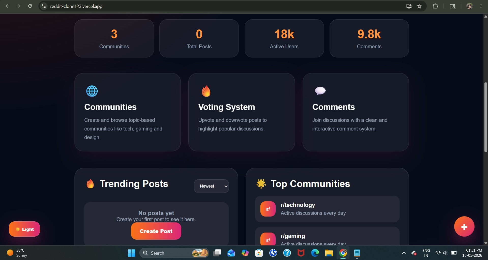


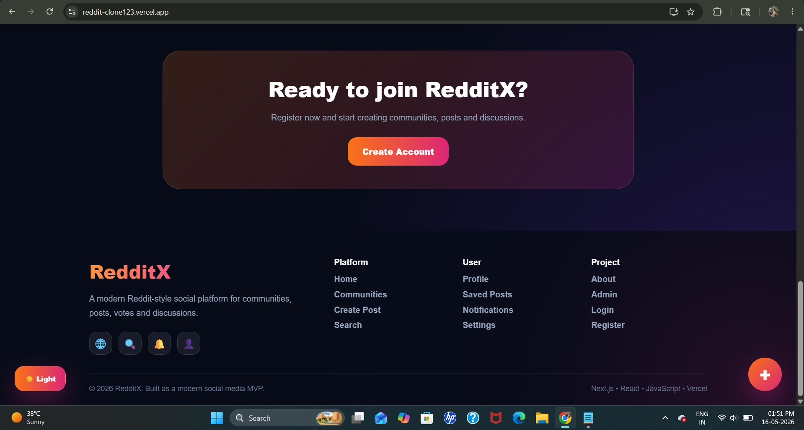


*  **Login/Register**

  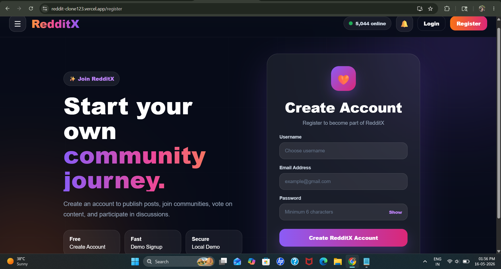
  
  
  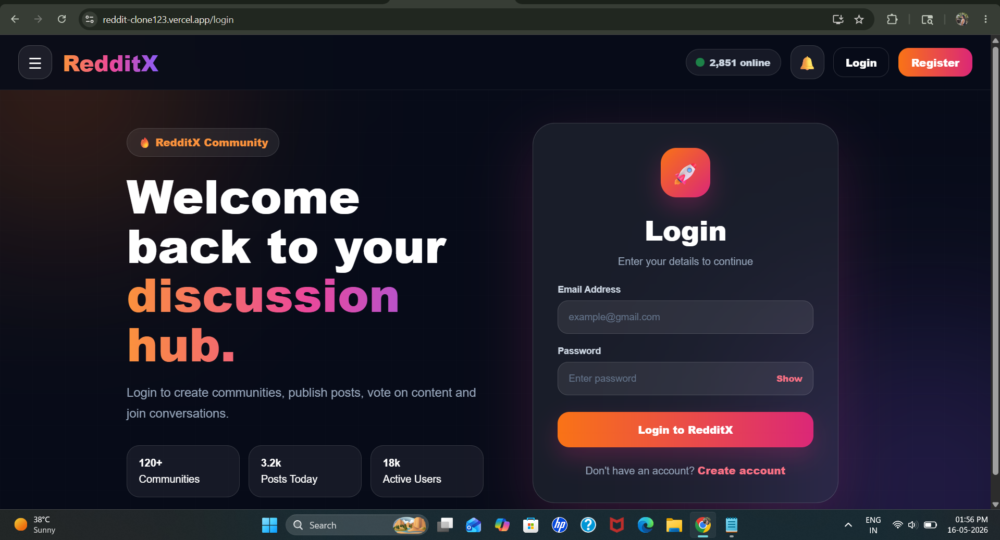
  
  
*  **Create Post**
  
  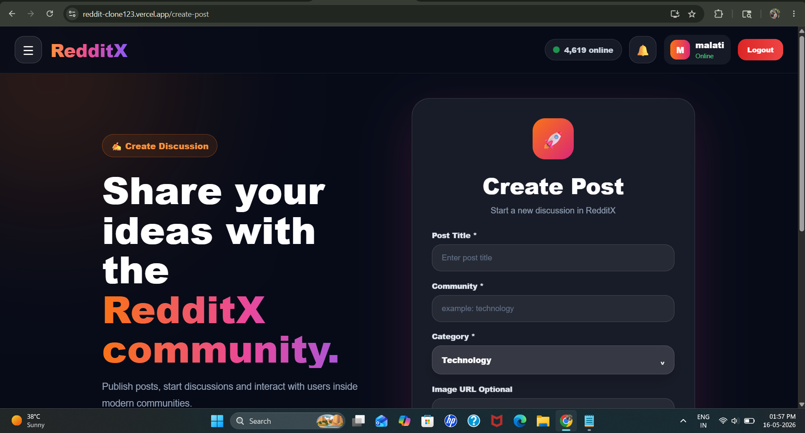
  

   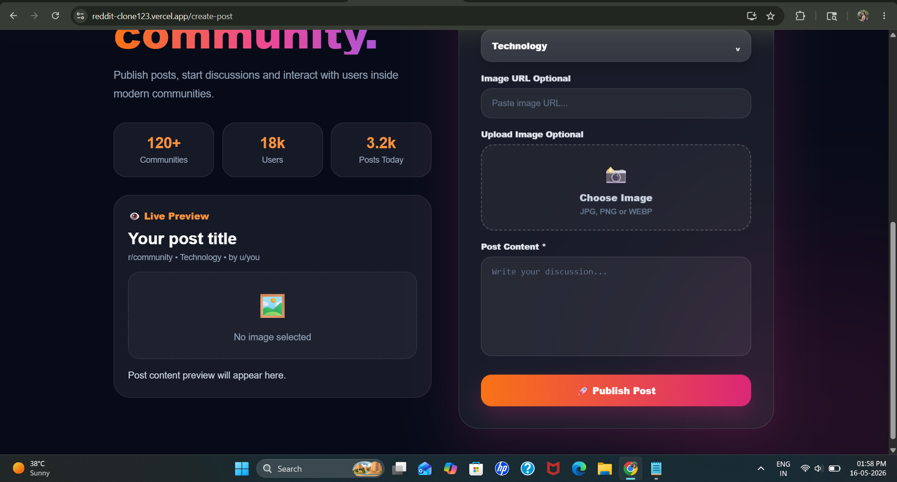
   
  
*  **Communities**
  
 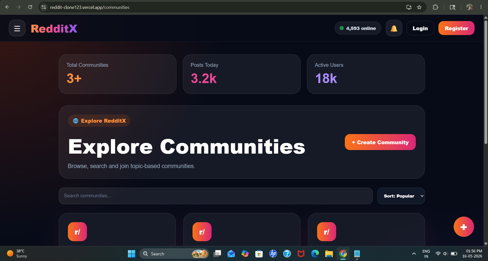
 

 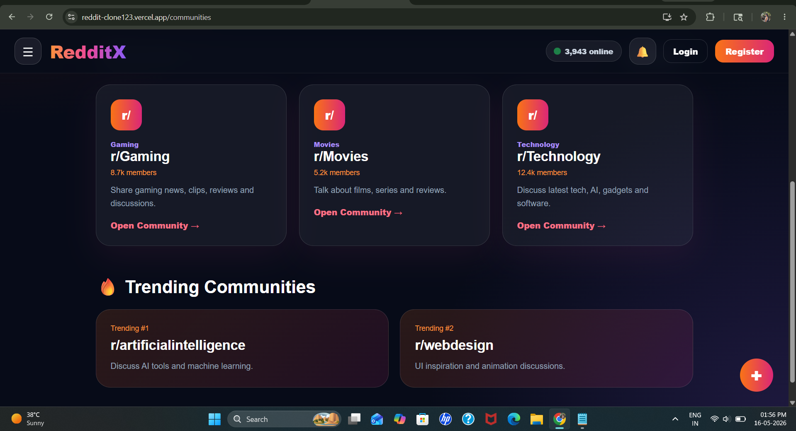
 

* **Search System**

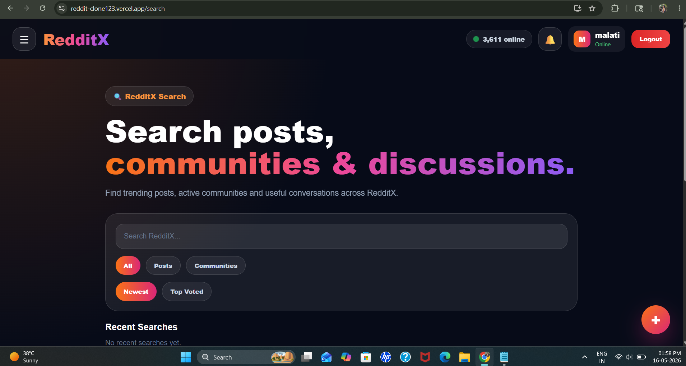


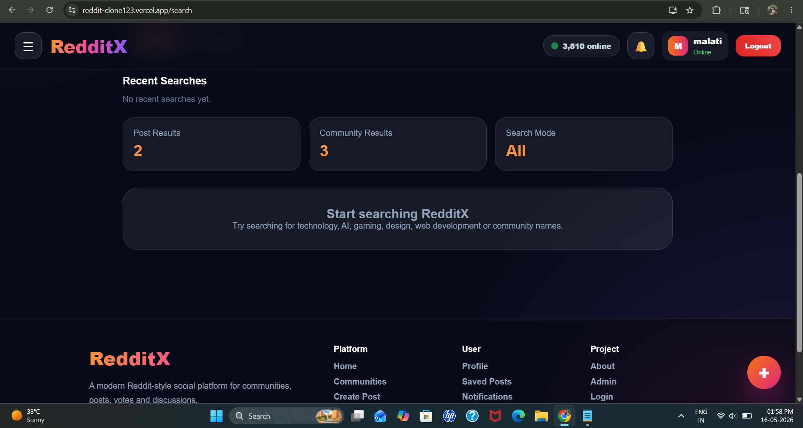


* **Saved Posts**

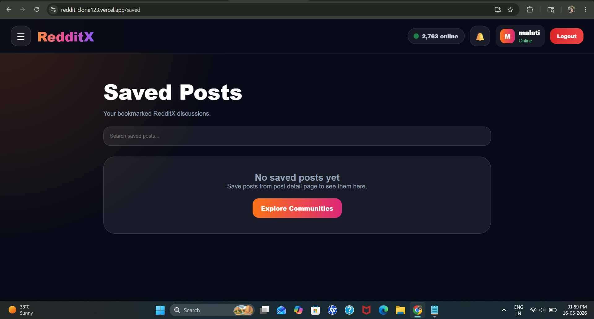


* **Notifications**

  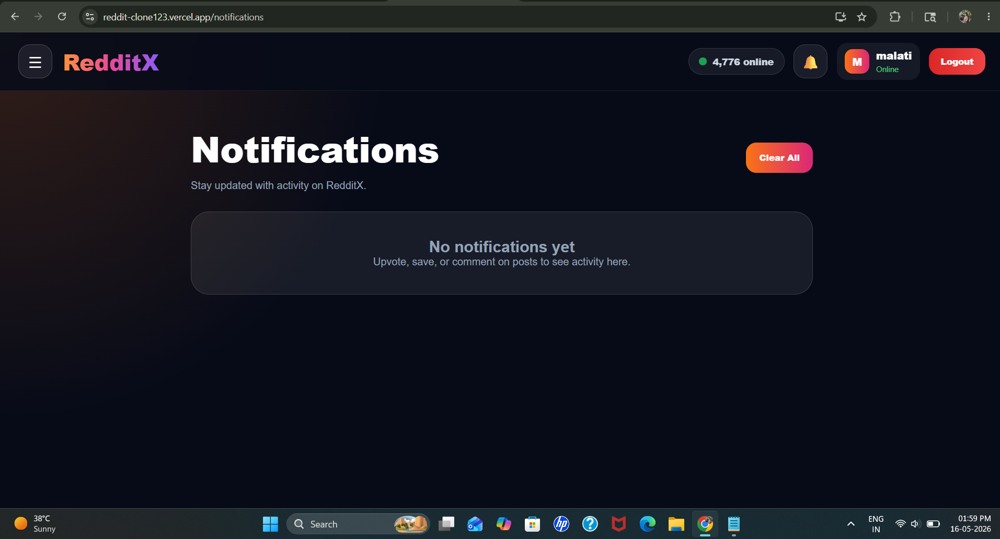

  
* **Post Details**
  
  
  

  
  
  
* **Admin Dashboard**
  
  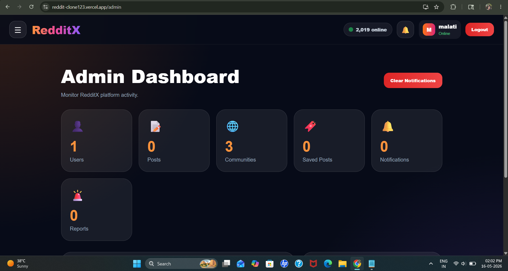
  
  
  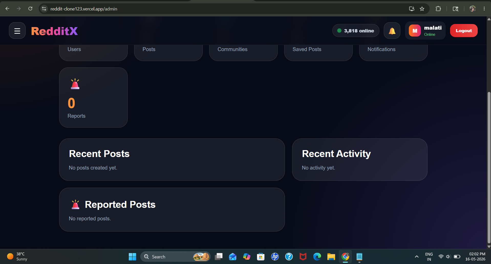

  
* **Setting System**

  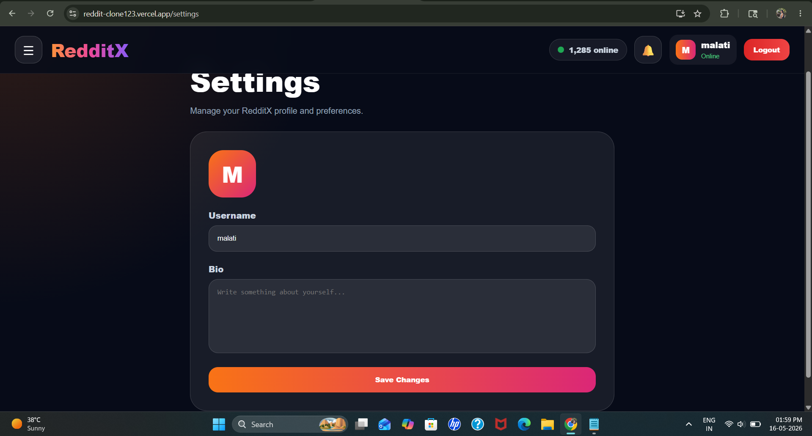


* **Profile Page**

  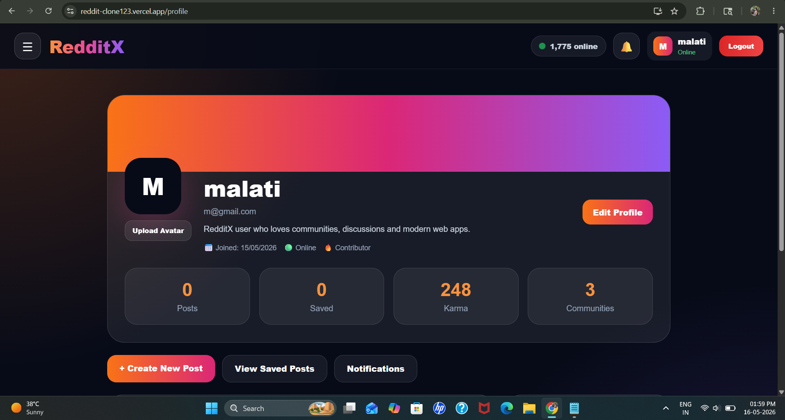
  

  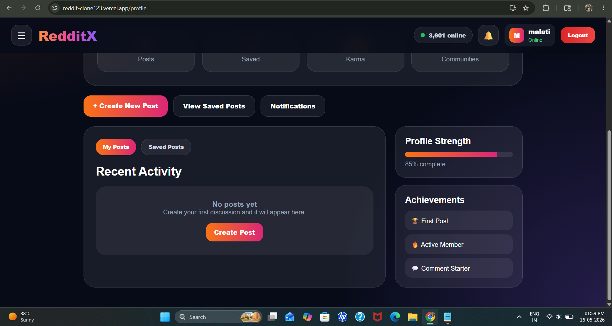


* **404 Page**

  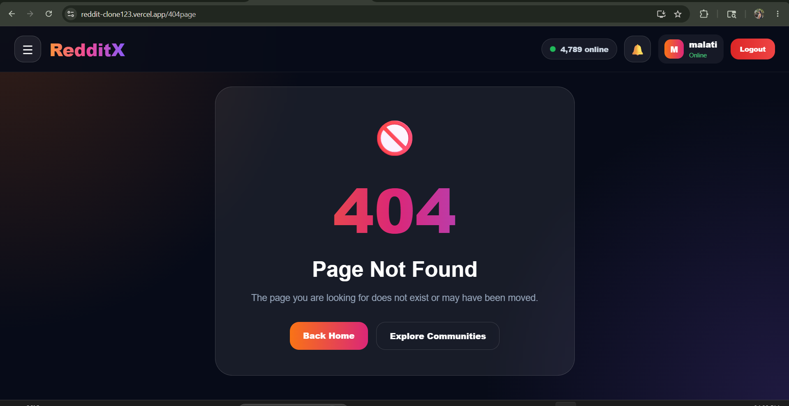


---

# 📱 Responsive Support

RedditX works on:

* Desktop
* Tablet
* Mobile Devices

---

# ⭐ Future Improvements

* Real Backend Integration
* Database Support
* Real Authentication
* Chat System
* Live Comments
* Real-time Messaging
* AI Recommendations
* Media Upload System
* Community Moderators

---

# 👨‍💻 Developed By

Kesar Karale

---
